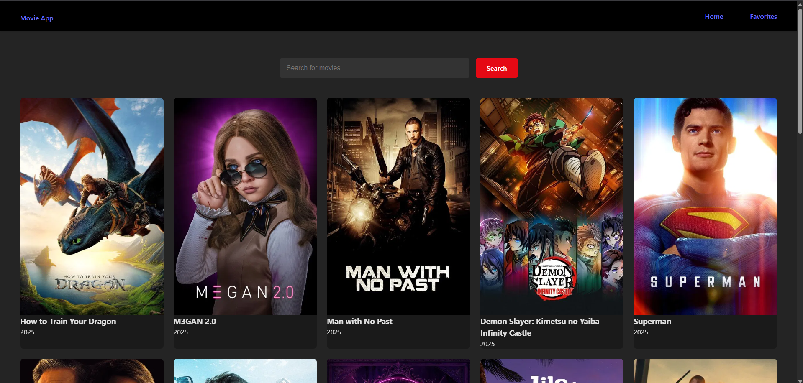
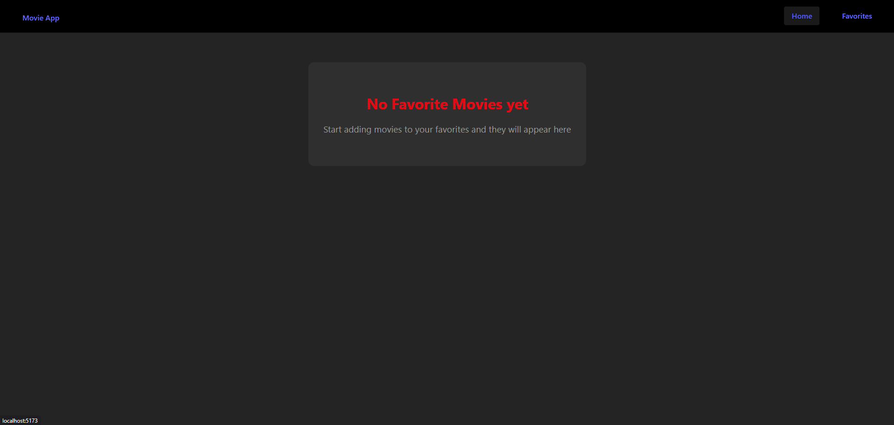

# 🎬 Movie App

A fully responsive video streaming frontend built with **React.js**, mimicking the layout and functionality of YouTube. This project demonstrates proficiency in **HTML**, **CSS**, **JavaScript**, and **React** features including **Hooks**, **Context**, and **Routing**.

## 🚀 Features

- 📺 Explore trending and popular movies
- 🔍 Search functionality with real-time filtering
- 🧭 Page navigation using **React Router DOM**
- ⚙️ Dynamic rendering using **React Hooks** (`useState`, `useEffect`, `useContext`)
- 💡 Clean and responsive UI using **CSS Flexbox/Grid**
- 🧱 Reusable, modular component structure

## 🛠 Tech Stack

- **Frontend**: HTML, CSS, JavaScript, React.js
- **Routing**: React Router DOM
- **State Management**: React Hooks + Context API
- **API**: Uses public movie api from The Movie Database (TMDB)

## 📦 Getting Started

1. **Clone the repository**
  
  ```bash
  git clone https://github.com/anubhav-m/movie-app.git
  cd movie-app
  ```
  
2. **Install dependencies**
  
  ```bash
  npm install
  ```
  
3. **Run the development server**
  
  ```bash
  npm run dev
  ```

  ## 🖼 Preview

  
  